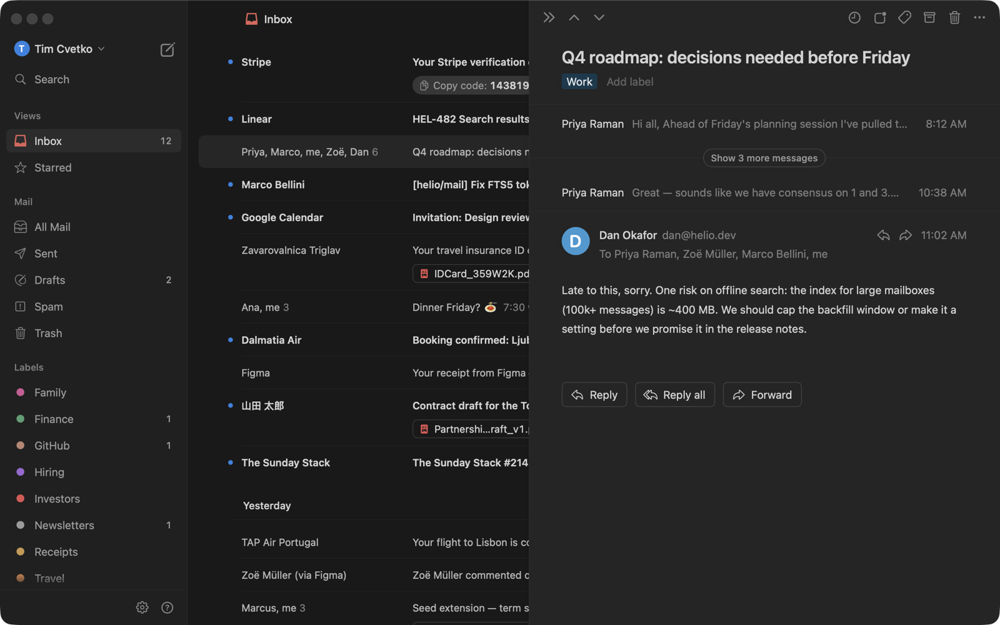
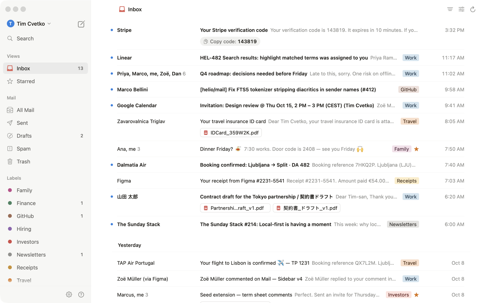

# AxiosM

A fast, native Gmail client for macOS and iPhone, written in SwiftUI. The design follows Notion Mail's look;
this is an independent project, not affiliated with Notion.



- **Local-first.** Mail syncs into a SQLite database (GRDB, with full-text search), so the list, search and threads
  open instantly and work offline. Changes made offline are queued and sent to Gmail when you reconnect.
- **Keyboard-driven.** A ⌘K command palette, shortcuts for triage, and bulk actions on selected rows.
- **Multiple accounts**, each with its own database and login.
- **Integrations.** Save threads to a Notion database or link them to pages, and see today's Google Calendar events
  in the sidebar.
- **Claude can use your mail.** `nmail-mcp` is an MCP server bundled with the app: search, read, triage, draft and
  send, with an on-screen approval for anything that sends or deletes. See [mcp/README.md](mcp/README.md).
- **iPhone app** built on the same `MailCore` package. See [ios/README.md](ios/README.md).



## Requirements

- macOS 15 or later, Swift 6 (Xcode 16)
- A Google Cloud OAuth client of your own (Gmail has no shared public client)

## Set up Google sign-in

1. In [Google Cloud Console](https://console.cloud.google.com/), create a project and enable the **Gmail API**
   (plus the **Google Calendar API** if you want the calendar panel).
2. Configure the **OAuth consent screen** and add the scopes the app asks for: `gmail.modify`, `gmail.compose`,
   `gmail.settings.basic`, `calendar.readonly` and `userinfo.profile`.
3. Under **Credentials → Create credentials → OAuth client ID**, pick **Desktop app** and download the JSON.
4. Save it as `~/.config/mail/client_secret.json`.

While the consent screen is in **Testing**, add each Gmail address you'll use as a test user. Google expires
Testing-mode logins after 7 days, so switch the consent screen to **In production** to avoid signing in every week.
For personal use it doesn't need verification; Google just shows an "unverified app" warning at sign-in.

## Build and run

```sh
swift run Mail                 # debug build
scripts/install.sh             # release build, installs /Applications/AxiosM.app
MAIL_DEMO=1 swift run Mail     # fixture mail, no network or Google account needed
swift test
```

`scripts/snap.sh [dir] [screens...]` renders every screen in light and dark from demo data, which is how the
screenshots above were made.

## Where things live

| Path | What |
|---|---|
| `Sources/MailCore` | Gmail client, OAuth, sync, GRDB store, MIME parsing, compose, signatures, accounts, integrations |
| `Sources/Mail` | The macOS app (SwiftUI) |
| `Sources/MailMCP`, `Sources/nmail-mcp` | The MCP server |
| `ios/` | The iPhone app (XcodeGen project) |
| `design/` | Design spec, tokens and layout notes |
| `Tests/MailTests` | Unit and end-to-end tests, with fixture mail |

Local data is stored in `~/Library/Application Support/Mail` (`accounts/<email>/mail.sqlite`), and the sync log in
`~/Library/Logs/NMail/sync.log`. Refresh tokens are stored in `secrets.json` (mode 0600) on the Mac and in the
Keychain on iPhone. They never leave your machine except to talk to Google.

## Fonts and icon

The Inter and iA Writer Mono font files in this repo are under the SIL Open Font License. The icon is derived from a CC BY-SA 4.0 photo; see [Icon/CREDITS.md](Icon/CREDITS.md).
